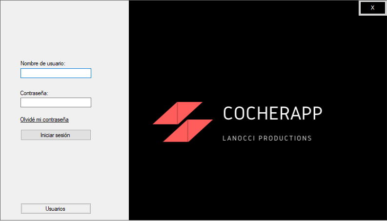
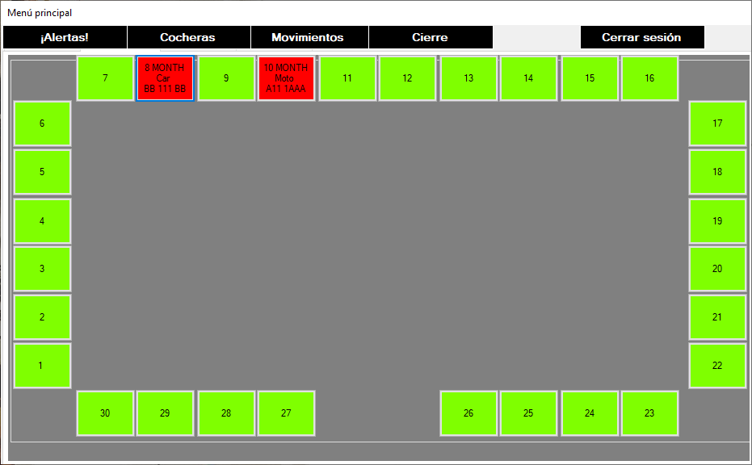
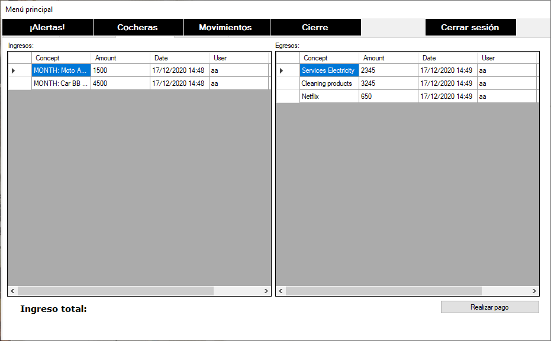
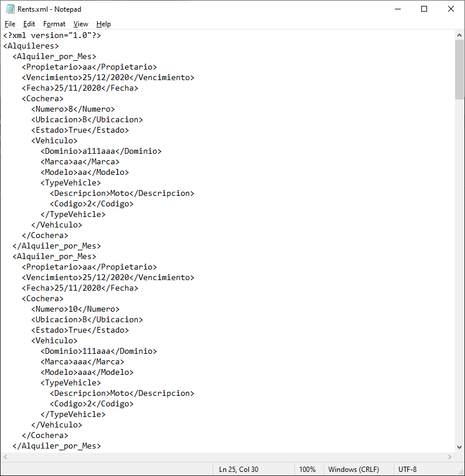

# .net-framework-garage-application
.NET framework application for a garage's system, using only winforms and XML as a way to create data persistence

---

## Log in screen

---

## Principal menu screen

---

## Movements

---

## Xml file example

